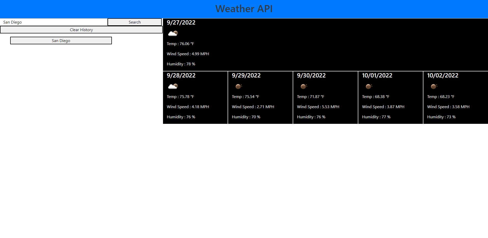

# Weather API

## Description
This is a simple web-app used to interact with the openweatherapi.

## Installation

N/A

## Usage

Enter a city name into the `Search for City...` bar in the top left hand portion of the screen, then hit the `Search` button to get the weather forecast.

Previous searches will be saved and can be clicked on the request the data again.

[Deployed Page](https://wlk-dev.github.io/weather-api/)

## Credits

N/A
